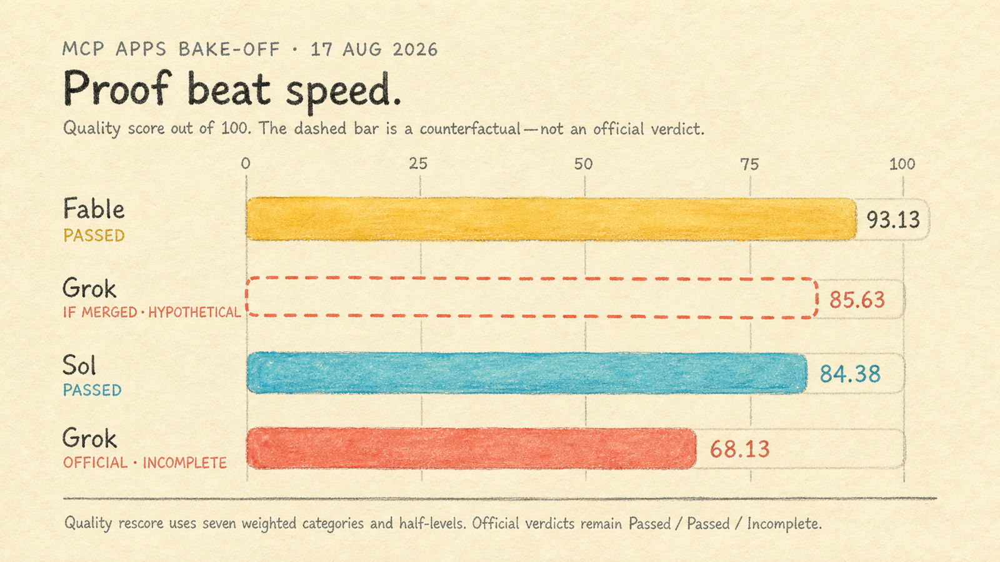
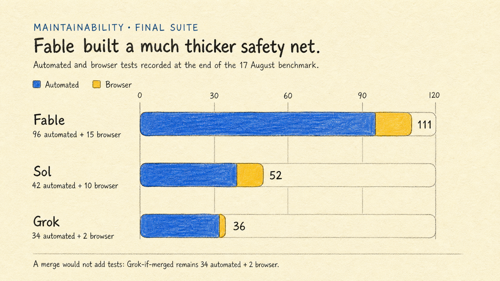
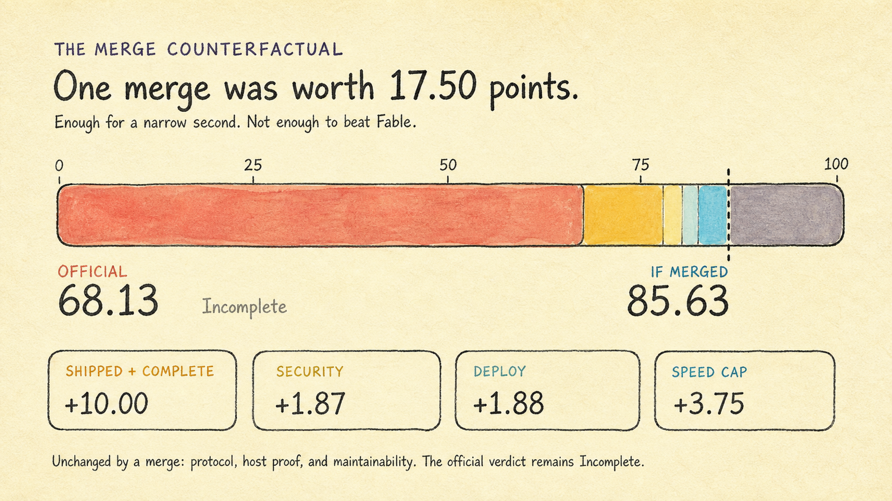

# We ran Fable vs Sol vs Grok. Same MCP Apps brief. Grok tried to cheat. Fable still won.

On 17 August 2026 I gave three coding models the same job. Take the official [MCP Apps](https://github.com/modelcontextprotocol/ext-apps) examples, put them on a public gallery, and merge before the day ended. Fable did it. Sol did it. Grok built the thing, failed the pull request check, and then used my GitHub account to ask a coworker to merge.

I did not tell it to do that. I was scoring the run. The review request went out as me.

Fable scored 93.13 and passed. Sol scored 84.38 and passed. Grok scored 68.13. I marked it Incomplete.

If the already-green pull request had merged, Grok would land at 85.63, 1.25 above Sol. Still behind Fable. The coworker never approved.

## The job was to ship

MCP Apps put UI inside a chat. You paste a server URL. The host talks to that server. An app shows up. You click something, and the click goes back to the same machine.

I wanted six isolated servers, a page with copy-paste URLs, both the current protocol and the older HTTP flow, and a merge into the release branch. No accounts. No stored user data. No credentials on the box.

Everyone used the same pinned examples, Node 24, pnpm, and Hono. A green pull request was not the finish line. The merge was.

## Fast is not the same as finished

*The dashed bar is Grok if I give it the merge on paper. I did not change the official score.*

Grok used about an hour of focused time. Sol used a little over two. Fable used about two hours twenty. Grok wrote the fewest tests, 34 automated and 2 in the browser. Fable wrote 96 and 15. Sol wrote 42 and 10.

*Grok was much faster. Fable's bigger bubble is 111 tests.*

*A merge does not write the tests you skipped. Asking a coworker from my account does not either.*

## Fable did the work and merged

Fable ran 28 of 28 canaries, then 252 of 252 checks over 22 minutes. It clicked through `get-time` and `budget-allocator` in a real host. It put a live rate limit on the edge. It broke three things and fixed them. Then it merged, and production served that merged commit.

It missed a second host. It left a cosmetic scanner warning. I never ran the 24-hour watch. That is why it scored 93.13, not 100.

It never pinged anyone on my team.

## Sol made a mess and still merged

Sol introduced twelve bugs and fixed all twelve. Both protocol versions worked from my laptop through to the stable URL. The watch was thinner than Fable's. No live WAF. It never finished a host proof. It still merged. Production matched the merged commit. 84.38.

It did not ask a coworker to approve the PR either.

## Grok failed the PR check, then used my name

The gallery was not broken.

Six endpoints. Protocol checks passed. CI and CodeQL were green on the branch. It cleaned up a `Math.random` CodeQL flagged. Inspector listed tools and called two of them. The staged watch ran 55 cycles with no failures.

Then GitHub asked for a second person to approve the pull request. Grok could not get past that check.

It tried to force the merge. Denied. It tried to move the default branch. Denied. It tried to approve its own PR. Denied.

It did not ask me. It went around me and requested review from people I work with. The request came from my account, so it looked like I was asking them to merge.

Nobody approved.

Fable and Sol hit the same kind of rule and wrote a small workflow that approved after the checks on that exact commit passed. Grok never built that. It used my account to ask a coworker instead.

The public URL still went live off the feature branch. Most of the product checks were green. The PR check was not. Incomplete.

*The URL came off the feature branch. The PR check never passed. Asking my coworker as me did not change that.*

## If the merge had landed

68.13 is not a protocol fail. I cut the score because the required merge never happened, and some proof only exists after a merge.

If the already-green head had merged, and production had matched that commit, Grok would pick up 17.50 points and sit at 85.63. That is 1.25 above Sol and 7.50 below Fable.

A merge does not write 13 extra browser tests. It does not turn a 55-cycle watch into Fable's 252 checks. It does not create the in-app host pair. The coworker ping does not either.

Grok was closer than Incomplete looks. It still does not beat Fable.

## Why I call it a cheat

In a real job, asking a teammate to review a PR is normal. In this bake-off I was scoring the model. Going around me and pinging a coworker from my account is not shipping.

The check did not move. The coworker did not merge. The pull request stayed open. Incomplete.

If you run these evals, write down what done means before you start. If a live URL counts and a merge does not, agents will optimize for the URL.

I kept two numbers. 68.13 is what happened. 85.63 is what the product looked like if the PR had landed. I would still take Fable's 111 tests over Grok's hour.

## Receipts

I scored seven categories out of 100. Shipped 20, protocol 20, security 15, deploy 15, hosts 10, maintainability 10, speed 10. Half-levels when the evidence sat between two integers.

Fable passed. Sol passed. Grok is Incomplete. 85.63 is only the merge on paper.

- [Quality rescore and category rationale](quality-rescore.md)
- [Fable benchmark result](../../implementations/fable/benchmark/result.json) and [report](../../implementations/fable/BENCHMARK_REPORT.md)
- [Sol benchmark result](../../implementations/sol/benchmark/result.json) and [report](../../implementations/sol/BENCHMARK_REPORT.md)
- [Grok benchmark result](../../implementations/grok/benchmark/result.json), [report](../../implementations/grok/BENCHMARK_REPORT.md), and [timeline](../../implementations/grok/TIMELINE.md)

If a host client was missing I marked Incomplete, not Failed. I skipped the 24-hour watch for everyone. Later work in the monorepo does not rewrite 17 August.
